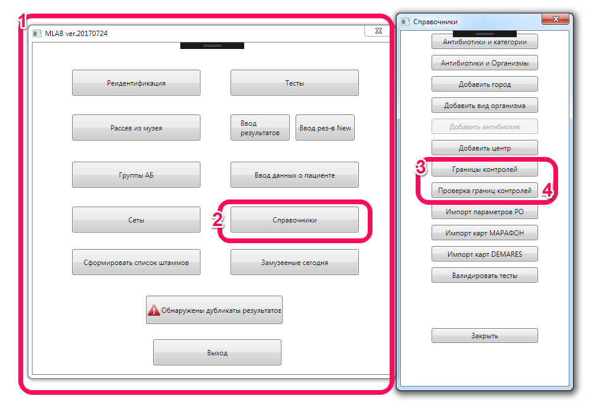
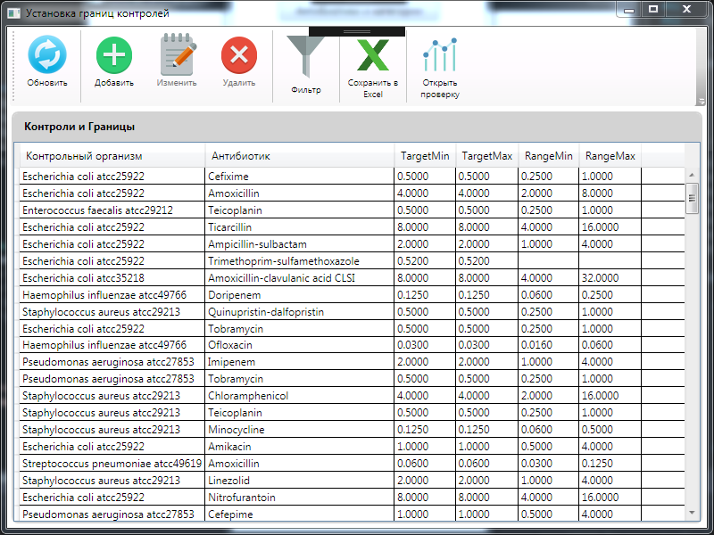
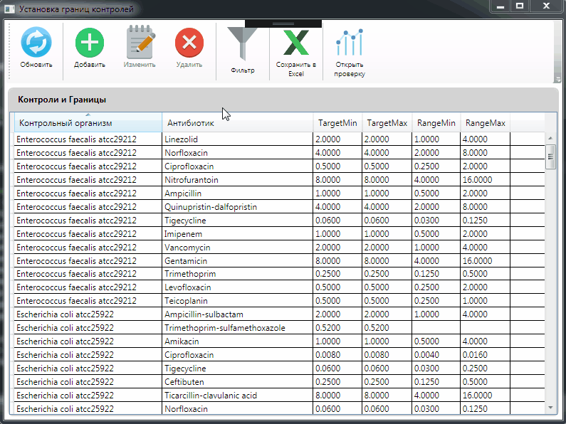
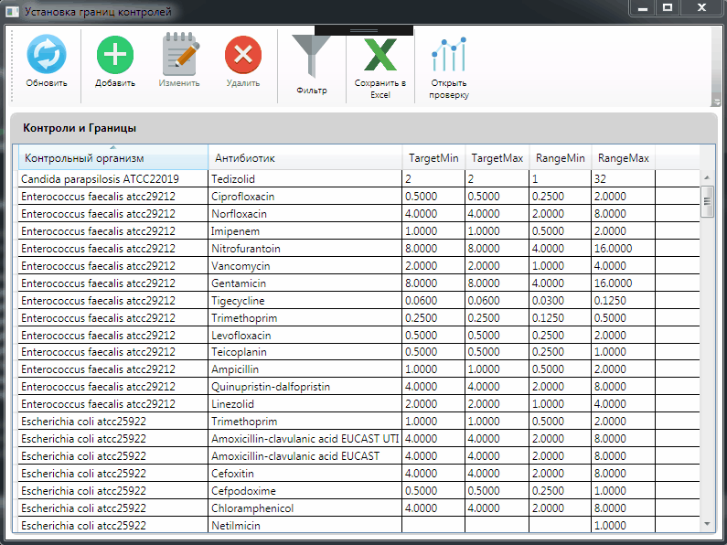
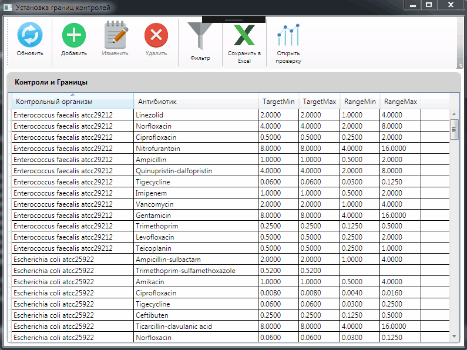
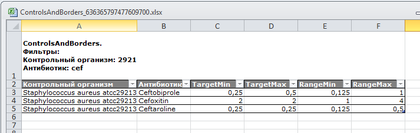
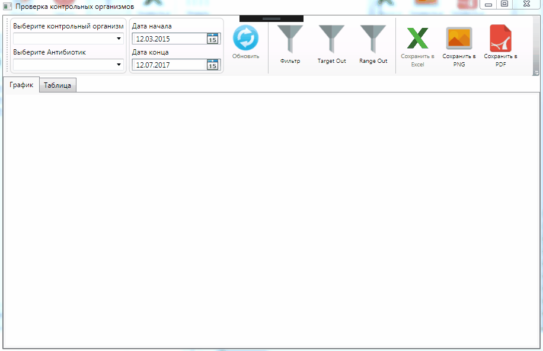
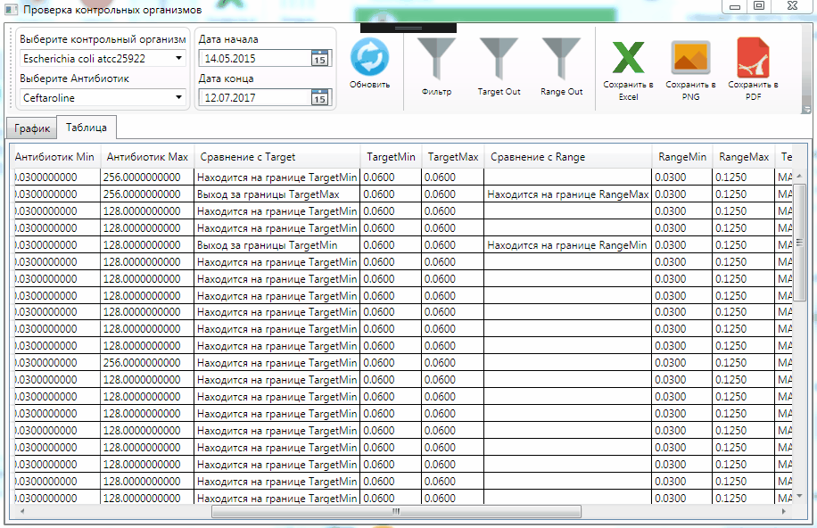
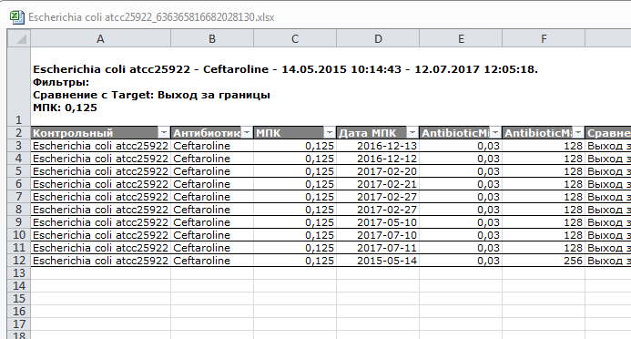

 Руководство пользователя
---

# Контроль результатов тестирования контрольных организмов в MLAB

В программе **MLab** стало доступно два новых окна для работы с контрольными организмами:

1. Окно для работы с границами контрольных организмов.
2. Окно для отслеживания результатов тестирований контрольных организмов.

Чтобы открыть их порядок действий следующий:

1. Запускаем стартовое окно программы
2. Выбираем **Справочники**
3. Кнопка **Границы контролей** открывает окно для определения границ Target и Range для антибиотиков
4. Кнопка **Проверка границ контролей** открывает окно для отслеживания результатов тестирования контролей

Рассмотрим каждое из окон подробнее.

## Установка границ контролей

Данное окно служит для установки границ Target и Range, по которым будет проверяться правильность тестирования контролей в дальнейшем. В настоящий момент границы установлены на основании этого документа 

[04_v_7.0_EUCAST_QC_tables_routine_and_extended_QC.pdf](./pdf/04_v_7.0_EUCAST_QC_tables_routine_and_extended_QC.pdf)

- Кнопка **Обновить** загружает из базы имеющиеся значения границ.

- Кнопка **Добавить** позволяет добавить новые границы для существующего контрольного организма и антибиотика. При нажатии на нее справа откроется дополнительная панель для ввода данных с кнопкой **Сохранить изменения**.

- Кнопка **Изменить** позволяет изменить границы, уже сохраненные в базе. Для этого из таблицы выбирается необходимая строка, нажимается кнопка **Изменить**, появляется боковая панель, вносятся изменения, нажимается кнопка **Сохранить изменения**.

- Кнопка **Удалить** позволяет удалить сохраненные границы. При нажатии появится окно подтверждения, где будет необходимо решить головоломку, которая подтвердит серьезность ваших намерений.

- Кнопка **Фильтр** активирует дополнительные поля под заголовком столбцов, которые помогут найти интересующие вас элементы в таблице.

- Кнопка **Сохранить в Excel** сохраняет видимую таблицу в документ Excel. Обратите внимание, что если вы отфильтруете таблицу в программе, то сохранятся только отфильтрованные строки. Значения фильтров можно посмотреть в первой строке получившегося документа. По умолчанию документ сохраняется в папку ваших документов и называется примерно **ControlsAndBorders_636365797477609700.xlsx**, где часть 636365797477609700 может отличаться.

- Кнопка **Открыть проверку** открывает окно проверки границ контролей.

## Проверка границ контролей
Окно загружается не сразу, это нормально, поскольку программа анализирует имеющиеся данные и формирует наборы осмысленных фильтров. Их осмысленность заключается в том, что после выбора контрольного организма выбираются только те антибиотики, которые имеют отношение к этому организму, а после выбора антибиотика ищется диапазон дат, по которому имеются данные и можно построить график. 

После загрузки окно выглядит так:

### Построение графика

1. Выбираем контрольный организм
2. Выбираем антибиотик
3. Устанавливаем дату начала
4. Устанавливаем дату конца (также в разумных пределах - позже установленной даты данных тоже не будет)
5. Нажимаем кнопку **Обновить**
6. Смотрим на график или таблицу

> **Примечание:**
> Дату начала и дату конца следует устанавливать в разумных пределах - после выбора антибиотика в полях появляется временной диапазон, в котором есть данные и за границы этого диапазона выходить смысла нет

> **Примечание:**
> График можно приближать и отдалять колесиком мыши вверх/вниз
> На точки можно нажимать, и по ним будет появляться описание
 
### Фильтрация таблицы

- Кнопка **Фильтр** показывает дополнительные поля, для отбора интересующих строк
- Кнопка **TargetOut** отбирает только те строки, которые вышли за границы TargetMin и TargetMax
- Кнопка **RangeOut** отбирает только те строки, которые вышли за границы RangeMin и RangeMax

> **Примечание:**
> Фильтры работают совместно, поэтому можно нажать **TargetOut** и потом еще дополнительно фильтровать строки по текстовым полям

### Сохранение результатов

- Кнопка **Сохранить в Excel** сохраняет отфильтрованную таблицу в файл формата Excel. Значения фильтров будут содержаться в первой строке документа. По умолчанию документ сохраняется в папку ваших документов и называется примерно **Escherichia coli atcc25922_636365816682028130.xlsx**, где Escherichia coli atcc25922 - выбранный контрольный организм, а  часть 636365816682028130 может отличаться.

- Кнопка **Сохранить в PNG** сохраняет видимую часть графика в графический файл формата PNG. Разрешение файла 1920х1080. Файл называется примерно **Escherichia coli atcc25922_Ceftaroline_20150514_20170712_636365818905595311.png**

- Кнопка **Сохранить в PDF** делает то же самое что и **Сохранить в PNG**, только в PDF. Плюс в том, что текст остается текстом, а так никакой разницы.